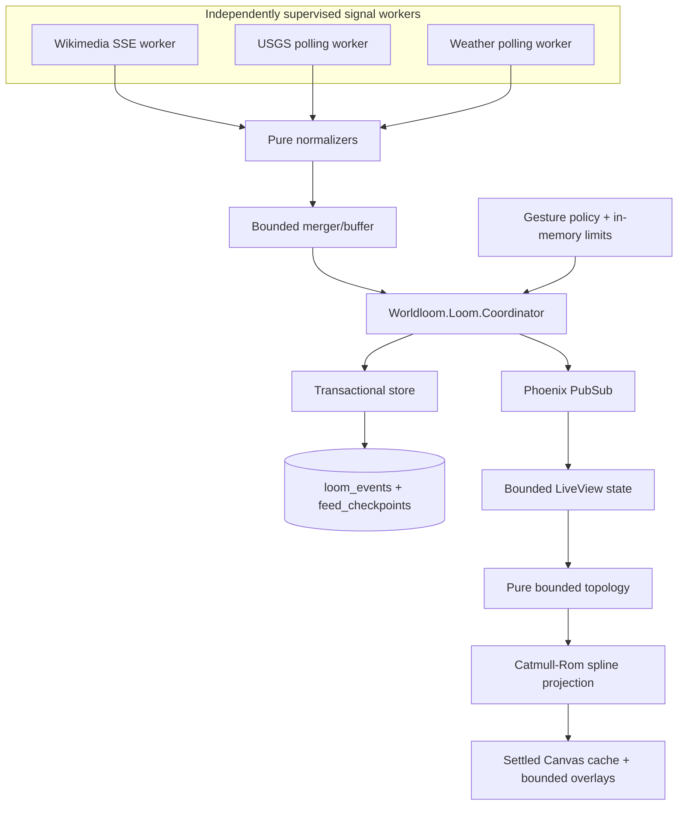

# Worldloom architecture

Worldloom is an append-only event system with a real-time projection. OTP owns the
authoritative sequence; PostgreSQL owns durable history; browsers own drawing and
animation.

## Runtime shape

The application supervisor also starts Phoenix Presence, the in-memory rate limiter,
feed-health monitoring, telemetry, and the HTTP endpoint. Each feed worker is isolated
under a `:one_for_one` supervisor, so a failed source does not take down the loom or
the other sources.

## The core invariant: persist, then broadcast

`Worldloom.Loom.Coordinator` is the only process that publishes loom events. It asks
`Worldloom.Loom.Store` to commit first and broadcasts only the returned database rows.
If persistence fails, nothing is published. A browser therefore never treats an
uncommitted formation as history.

The event's PostgreSQL bigint primary key is its global sequence. The stored
`render_version`, deterministic `render_seed`, normalized lane, intensity, and
allow-listed visual payload make reconstruction independent of transient process or
browser state.

There is one important crash seam: a coordinator can stop after a commit and before
its broadcast. Clients carry a sequence watermark, queue out-of-order instructions,
and request a bounded missing range. A fresh coordinator initializes its watermark
from the highest stored sequence, so a restart does not invent or rewind history.

## External ingestion and checkpoints

Wikimedia's stream is aggregated into one-second summaries. USGS is polled once per
minute, and Open-Meteo once per ten minutes. Each response passes through a pure
normalizer that validates types and bounds before building a small internal event.

External events and the corresponding source checkpoint are written in the same
database transaction. Wikimedia cursors and HTTP ETags therefore never advance past
events that failed to become durable. Source/external-id uniqueness makes retries
idempotent. A successful response with no new events may still advance its checkpoint
and freshness timestamp.

Feed workers retry independently with capped exponential backoff and jitter. The
health monitor reports only coarse `live`, `quiet`, or `stale` states to the interface;
it does not expose cursors, ETags, upstream bodies, or error internals.

## Bounded work and history

All paths exposed to bursts have explicit limits:

- The ingestion buffer holds at most 16 entries. When saturated, compatible external
  events are merged into stronger aggregate signals instead of growing memory without
  limit.
- A LiveView initially loads 400 events, historical permalinks load 500 around the
  requested sequence, and every server-side event window is capped at 600.
- History pages contain at most 400 events and are throttled to one request per 500 ms.
- The renderer retains at most 600 ordered events plus 12 real Wikimedia scaffold
  instructions, 4,000 drawing commands, 600 queued out-of-order instructions, eight
  active transitions, and 12 aggregate viewer pulses.
  Settled geometry lives in one detached canvas whose dimensions track the visible
  canvas rather than growing with history.
- The accessible formation stream retains the latest 20 textual controls.
- Payloads are limited to 16 KiB; checkpoint metadata is limited to 8 KiB.

Historical rows themselves are retained in PostgreSQL for v1. The first storage review
occurs after 30 days of production evidence; compaction is intentionally not designed
in advance of that measurement.

## Visitor path

Each Tug, Knot, or Illuminate button submits its own action directly with the current
lane; there is no client-side selected gesture or separate confirmation step. The
browser may submit only those three names with a lane from 0.0 to 1.0, and only while
it is at the live edge. The LiveView boundary parses and bounds form text before the
gesture policy validates all of those facts again. A random signed-cookie token
receives a 30-second cooldown, during which every gesture action remains disabled. A
second coarse token bucket uses a short-lived, salted HMAC of the peer address in ETS.
Accepted gestures enter the same persistence and broadcast path as public feeds; the
canvas never draws an optimistic, uncommitted gesture.

No client chooses the horizontal coordinate, sequence, visual seed, free-form content,
or rendering contract.

## LiveView and rendering

`WorldloomWeb.WorldLive` owns navigation, a bounded trusted-event map, aggregate
Presence, safe formation details, gestures, catch-up, and history requests. It sends
compact drawing instructions to the `Worldloom` hook. A separate 12-instruction
Wikimedia scaffold preserves a real public backbone when the ordered live window is
entirely visitor activity; it never changes the trusted window, watermark, or archive
cursor. Reloads refresh this scaffold and the held weather context, while progressive
history replaces the live-edge scaffold with real Wikimedia events at or before the
historical page.

`topology.js` turns the bounded instruction window into stable anchors, branches,
connectors, and visitor formations without access to the viewport, canvas, clock, or
DOM. `geometry.js` projects that graph through centripetal Catmull-Rom splines converted
to cubic Bézier segments. Consecutive visitor events share a bounded monotonic display
band, and sparse durable-event gaps are capped to eight display steps, while every event
retains its raw sequence identity. Held ambient weather is remembered independently and
does not participate in horizontal spacing. Replaying the same stored instruction set
therefore yields the same graph relationships at any viewport size.

The Canvas 2D renderer owns hit testing, focus traversal, panning, resize, and local
animation timestamps. It composites a detached cache of settled fibers and durable
ornaments, then draws at most eight transient growth or gesture overlays. Animation
ticks never rebuild topology; instruction-window changes, catch-up, history, resize,
pan, reload, and return-to-live are the explicit reconstruction boundaries. Settled
paths breathe only by translating that cache by at most 1.25 CSS pixels and varying
alpha by at most 0.04 over 12 seconds. Reduced-motion visitors receive the settled
cache directly with growth, breathing, viewer pulses, and animated return-to-live
disabled. Malformed geometry and future render versions degrade to bounded fallback
marks rather than aborting the frame.

## Single-instance assumption

Worldloom v1 deliberately runs one application instance. The locally registered
coordinator is the sole writer/publisher and needs no distributed election. Phoenix
PubSub and Presence are still used because they are the correct in-node fan-out and
aggregate-viewer primitives.

Running multiple application instances without a leader would create competing
coordinators and is unsupported. Multi-node leadership, distributed Presence, and
cross-node catch-up are deferred until real capacity evidence requires them.

## Recovery model

- **Application restart:** the coordinator reloads the highest sequence; LiveViews
  reload bounded rows and reproduce their instructions.
- **Feed disconnect:** only that worker backs off; history, gestures, and other feeds
  continue. The worker resumes from its durable checkpoint.
- **Database interruption:** commits stop and `/healthz` becomes unavailable; no
  uncommitted events broadcast. Workers retry bounded submissions.
- **Missed PubSub event:** the renderer detects a sequence gap and LiveView retrieves
  at most 600 missing rows or replaces the window with the latest 400.
- **Malformed upstream input:** the normalizer drops it before storage and records no
  raw payload.

Operational commands and signals are documented in [docs/operations.md](docs/operations.md).
