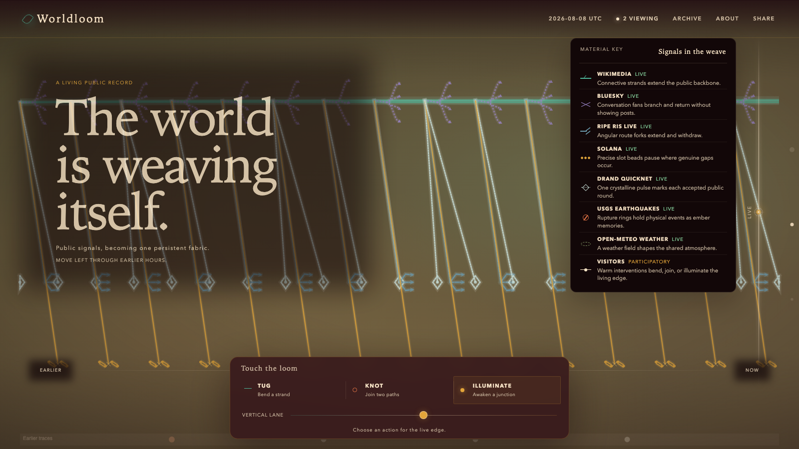
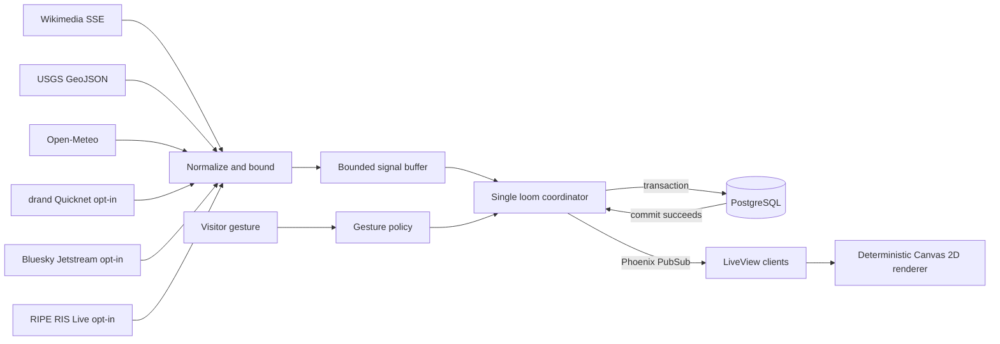

# Worldloom

> **The world is weaving itself.**

Worldloom is a persistent living tapestry woven in real time from Wikimedia edits,
earthquakes, global weather, and three small anonymous visitor gestures. Qualified,
false-by-default adapters can add drand rounds, Bluesky activity, and RIPE routing
motion after a source-specific canary. The present lives at the luminous right edge;
move left to revisit earlier UTC chapters.



Worldloom is currently available as public source and a local experience. A hosted
demo link will appear here only after public infrastructure is configured and verified.

It is an artistic aggregate—not an alerting, forecasting, operational, social,
cryptographic-verification, financial, or scientific analysis service. Upstream
activity is best-effort and may be delayed, revised, incomplete, or unavailable.

There are no accounts, names, chat messages, uploads, or visitor profiles. Every
formation is stored before it is broadcast, so two connected browsers see the same
committed artifact and a restart reconstructs it from PostgreSQL.

## What you can do

- Watch Wikimedia activity, USGS earthquakes, and global weather become distinct
  fibers, knots, ripples, and ambient shifts.
- Add a **Tug**, **Knot**, or **Illuminate** gesture at the live edge.
- Inspect a formation with pointer, touch, or keyboard and share its permanent link.
- Browse earlier UTC chapters without changing their history.
- Use reduced motion and the screen-reader formation summary without losing controls.

## How it fits together



The browser draws compact, versioned instructions; it never receives raw upstream
payloads. See [ARCHITECTURE.md](ARCHITECTURE.md) for invariants, recovery, bounds,
and the deliberately single-instance v1 design.

## Source posture

Wikimedia, USGS, and Open-Meteo run when the global feed switch is on. The three
incremental production-capable sources remain independently off until their canaries
are explicitly approved; Solana has no approved production endpoint.

| Source | Default | Public freshness | Recovery posture |
|---|---|---|---|
| Wikimedia | On | Quiet after 20 seconds | At most 60 seconds from a durable event ID |
| USGS | On | Quiet after 3 minutes | Idempotent rolling-feed polling with a private ETag |
| Open-Meteo | On | Stale after 30 minutes | Keep the last ambient state; retry locally |
| drand Quicknet | Off | Stale after 12 seconds | At most 20 exact rounds; report a larger gap |
| Bluesky legacy Jetstream | Off | Quiet after 20 seconds | Five-second overlap within a 60-second horizon |
| RIPE RIS Live | Off | Quiet after 20 seconds | Rejoin the live edge; never claim replay |

`WORLDLOOM_FEEDS_ENABLED=false` overrides every source. The independent opt-in
switches are `WORLDLOOM_DRAND_ENABLED`, `WORLDLOOM_BLUESKY_ENABLED`, and
`WORLDLOOM_RIPE_ENABLED`; `WORLDLOOM_SOLANA_ENABLED` must remain false in production.
Exact canary and rollback gates are in [docs/operations.md](docs/operations.md).

## Toolchain

| Component | Version |
|---|---:|
| Elixir | 1.20.2 on OTP 29.0.4 |
| Phoenix | 1.8.9 |
| Phoenix LiveView | 1.2.8 |
| Ecto SQL | 3.14.0 |
| Node.js | 24.18.0 |
| PostgreSQL | 14 or newer |
| Browser renderer | Canvas 2D, tested with Playwright Chromium |

The language runtimes are pinned in [`.tool-versions`](.tool-versions). PostgreSQL
must be running locally with a `postgres` role/password matching `config/dev.exs`,
or those development settings can be adapted for your machine.

## Run locally

```bash
git clone https://github.com/romankhadka/worldloom.git
cd worldloom
mix setup
npm ci
mix phx.server
```

Open [http://localhost:4000](http://localhost:4000). Development connects to the
three public feeds by default.

For a repeatable offline canvas, disable the feed workers and seed one deterministic
hour before starting Phoenix:

```bash
WORLDLOOM_FEEDS_ENABLED=false mix worldloom.seed_demo
WORLDLOOM_FEEDS_ENABLED=false mix phx.server
```

The seed task is idempotent: rerunning it does not duplicate its 120 demo signals.

## Verify a change

```bash
mix precommit
npm test
npm run test:e2e
```

The gates cover source normalization, transactional persistence, retry and checkpoint
behavior, LiveView interaction, deterministic rendering, keyboard/touch operation,
reduced motion, two-browser convergence, and reload reconstruction. The browser suite
uses an isolated `worldloom_e2e` database and deterministic feed-disabled data.

## Data, privacy, and accessibility

Worldloom uses [Wikimedia EventStreams](https://www.mediawiki.org/wiki/EventStreams),
the [USGS real-time GeoJSON feed](https://earthquake.usgs.gov/earthquakes/feed/v1.0/geojson.php),
and [Open-Meteo](https://open-meteo.com/en/docs). Qualified opt-in adapters target
[drand Quicknet](https://docs.drand.love/blog/2023/10/16/quicknet-is-live/),
[Bluesky legacy Jetstream](https://github.com/bluesky-social/jetstream-legacy), and
[RIPE RIS Live](https://ris-live.ripe.net/manual/). The public Open-Meteo endpoint
used here is a non-commercial tier; commercial deployment requires a fresh licensing
and API-plan review. Full field-level handling and attribution are in
[docs/data-sources.md](docs/data-sources.md).

Anonymous browser and network values exist only long enough to enforce contribution
limits; they are not written to loom events or public output. Read the exact behavior
in [docs/privacy.md](docs/privacy.md).

Every pointer interaction has a focus or tap equivalent. The app includes semantic
controls, visible focus, a textual live summary, non-color signal shapes, responsive
touch targets, and a reduced-motion renderer.

## Deploy and operate

A production release requires `DATABASE_URL`, `SECRET_KEY_BASE`, `PHX_HOST`, and
`WORLDLOOM_RATE_LIMIT_SALT`. Set `PHX_SERVER=true` to serve HTTP and use
`WORLDLOOM_FEEDS_ENABLED=false` for a feed-free environment. Deployment, health,
recovery, metrics, and incident procedures live in [docs/operations.md](docs/operations.md).

## Project links

- [Architecture](ARCHITECTURE.md)
- [Contributing](CONTRIBUTING.md)
- [Security policy](SECURITY.md)
- [Privacy](docs/privacy.md)
- [Data sources and attribution](docs/data-sources.md)
- [v1.0.0 release notes](docs/release-notes/v1.0.0.md)

Worldloom is available under the [MIT License](LICENSE).
